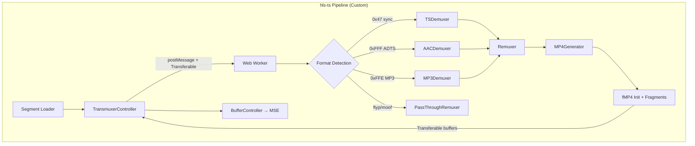
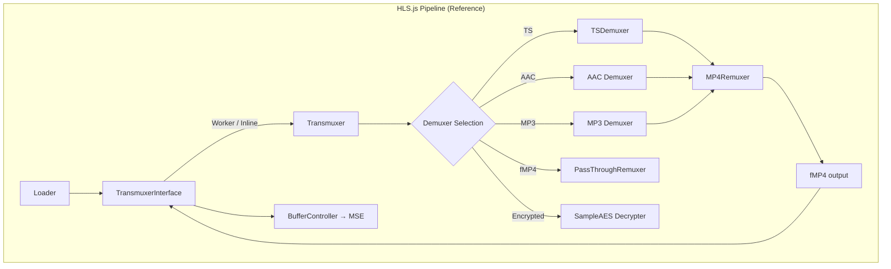

# Demuxer / Remuxer Comparative Report

> **hls-ts** (custom) vs **HLS.js** (reference) — `src/remux/` deep analysis

---

## 1. Architecture Overview

---

## 2. File Structure Comparison

### hls-ts `src/remux/` — 13 files, 1,677 LOC

| File | Lines | Role |
|------|------:|------|
| [tsdemuxer.ts](file:///home/meme/Documentos/hls-ts/src/remux/tsdemuxer.ts) | 320 | MPEG-TS demuxer (PAT/PMT/PES) |
| [mp4-generator.ts](file:///home/meme/Documentos/hls-ts/src/remux/mp4-generator.ts) | 455 | ISO BMFF box builder (ftyp, moov, moof, mdat) |
| [remuxer.ts](file:///home/meme/Documentos/hls-ts/src/remux/remuxer.ts) | 213 | Demux → fMP4 remuxing orchestrator |
| [exp-golomb.ts](file:///home/meme/Documentos/hls-ts/src/remux/exp-golomb.ts) | 140 | H.264 SPS bit-stream parser |
| [avc-stream.ts](file:///home/meme/Documentos/hls-ts/src/remux/avc-stream.ts) | 123 | H.264 NALU extraction + AVCC conversion |
| [mp3-demuxer.ts](file:///home/meme/Documentos/hls-ts/src/remux/mp3-demuxer.ts) | 72 | MP3 frame parser (simplified) |
| [transmuxer-worker.ts](file:///home/meme/Documentos/hls-ts/src/remux/transmuxer-worker.ts) | 71 | Worker thread entry point |
| [transmuxer-controller.ts](file:///home/meme/Documentos/hls-ts/src/remux/transmuxer-controller.ts) | 63 | Main-thread ↔ Worker bridge |
| [aac-demuxer.ts](file:///home/meme/Documentos/hls-ts/src/remux/aac-demuxer.ts) | 62 | Raw ADTS/AAC file demuxer |
| [aac-stream.ts](file:///home/meme/Documentos/hls-ts/src/remux/aac-stream.ts) | 59 | ADTS header parser + frame extraction |
| [types.ts](file:///home/meme/Documentos/hls-ts/src/remux/types.ts) | 54 | Shared type definitions + `IDemuxer` interface |
| [transmuxer-types.ts](file:///home/meme/Documentos/hls-ts/src/remux/transmuxer-types.ts) | 25 | Worker message protocol types |
| [passthrough-remuxer.ts](file:///home/meme/Documentos/hls-ts/src/remux/passthrough-remuxer.ts) | 20 | fMP4 passthrough (no re-muxing) |

### HLS.js (Reference) — separated `src/demux/` + `src/remux/`

| Directory | Key Files | Approx. LOC |
|-----------|-----------|------------:|
| `src/demux/` | `tsdemuxer.ts`, `adts.ts`, `mpegaudio.ts`, `mp4demuxer.ts`, `avc-video-parser.ts`, `hevc-video-parser.ts`, `sample-aes.ts`, `id3.ts` | ~4,000+ |
| `src/remux/` | `mp4-remuxer.ts`, `passthrough-remuxer.ts`, `mp4-generator.ts` | ~2,500+ |
| `src/demux/` | `transmuxer.ts`, `transmuxer-interface.ts`, `transmuxer-worker.ts` | ~800+ |

---

## 3. Feature Parity Matrix

| Feature | hls-ts | HLS.js | Gap Severity |
|---------|:------:|:------:|:------------:|
| **MPEG-TS Demuxing** | ✅ | ✅ | — |
| PAT/PMT parsing | ✅ | ✅ | — |
| PES packet assembly | ✅ | ✅ | — |
| Multi-packet PES spanning | ✅ | ✅ | — |
| **H.264/AVC** | ✅ | ✅ | — |
| SPS parsing (Exp-Golomb) | ✅ | ✅ | — |
| NALU → AVCC conversion | ✅ | ✅ | — |
| Codec string extraction | ✅ | ✅ | — |
| **H.265/HEVC** | ❌ | ✅ | 🔴 High |
| **AAC/ADTS** | ✅ | ✅ | — |
| ADTS header stripping | ✅ | ✅ | — |
| AudioSpecificConfig gen | ✅ | ✅ | — |
| HE-AAC (SBR) | ❌ | ✅ | 🟡 Medium |
| **MP3** | ⚠️ Stub | ✅ | 🔴 High |
| **AC-3 / E-AC-3** | ❌ | ✅ | 🟡 Medium |
| **Opus** | ❌ | ✅ | 🟡 Medium |
| **fMP4 Passthrough** | ✅ Basic | ✅ Full | 🟡 Medium |
| **ID3 Metadata** | ❌ | ✅ | 🟡 Medium |
| **SCTE-35 Markers** | ❌ | ✅ | 🟢 Low |
| **CEA-608/708 Captions** | ❌ | ✅ | 🟡 Medium |
| **Sample-AES Decryption** | ❌ | ✅ | 🔴 High |
| **AES-128 Decryption** | ❌ | ✅ | 🔴 High |
| **Web Worker Offload** | ✅ | ✅ | — |
| Transferable Objects | ✅ | ✅ | — |
| Inline Fallback | ❌ | ✅ | 🟡 Medium |
| **Discontinuity Handling** | ❌ | ✅ | 🔴 High |
| **DTS/PTS Normalization** | ⚠️ Basic | ✅ Full | 🟡 Medium |
| **Multi-track Audio** | ❌ | ✅ | 🟡 Medium |
| **Subtitle Tracks** | ❌ | ✅ | 🟡 Medium |

---

## 4. Demuxer Deep Dive

### 4.1 TSDemuxer

• hls-ts uses a callback pattern (`IDemuxer`) while HLS.js uses an event emitter.
• hls-ts handles basic PES spanning but lacks continuity counter validation.

### 4.2 AVC/H.264 Stream Parser

• hls-ts implements a full Exp-Golomb reader for SPS parsing.
• Gaps: No SEI parsing for captions, no AUD boundary detection.

---

## 5. Remuxer Deep Dive

### 5.1 Remuxer Core

• hls-ts creates a single init segment with both tracks.
• Gaps: No silent audio frame injection for gaps, no composition time offset corrections.

### 5.2 MP4 Generator

• Comprehensive box coverage for basic playback.
• Gaps: No `hev1`/`hvcC` boxes for HEVC support.

---

## 6. Gap Analysis Summary

### 🔴 Critical Gaps
1. **No HEVC/H.265 support**
2. **MP3 demuxer is a stub**
3. **No encryption support**
4. **No discontinuity handling**
5. **No main-thread fallback**

---

*Generated: 2026-05-12 · Project: hls-ts*
